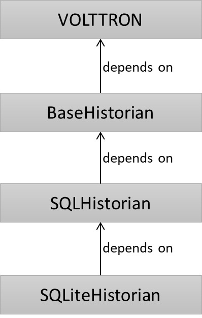

# VOLTTRON Agent Developer Instructions

The following documentation steps through the process of creating a simple agent using Poetry and Pipenv, how to 
get your code into github and publish to PyPi. VOLTTRON does not require use of Poetry or Pienv for package management.  
You can use any package manager for your agent, build a standard wheel file and use that wheel file to install the agent. 
However if you use poetry, pipenv or setuptools vctl install command can take a agent directory as input, build the 
wheel file, and install the wheel file. 

The second part of the tutorial is for advanced users and covers
 - how agents can be run in both modular and monolithic volttron server. 
 - Volttron libraries vs Agents
 - Extending VOLTTRON libraries and Agents
 - Making changes to multiple projects that depend on each other (handling dependency hierarchy in development environment)

## Requirements

###System level requirements:

The following requirements should be installed system-wide, so they are available to be
used throughout the tutorial.
```bash
# Python 3.8 is required for the installation of VOLTTRON
sudo apt-get update
sudo apt-get install -y build-essential libffi-dev python3.8-dev python3.8-venv openssl libssl-dev libevent-dev pipenv
```

Make sure you have ```pip``` installed
```bash
curl https://bootstrap.pypa.io/get-pip.py -o get-pip.py
python3.8 get-pip.py
```

### Install VOLTTRON
 
Initialize volttron to a new environment (can be a virtual environment or system level python)

   1. To install from PyPi, create and activate virtual environment if needed and then run ```pip install volttron``` 
      ```bash
      $> python3 -m venv /path/to/venv
      $> source /path/to/venv/bin/activate
      $> pip install volttron 
      ``` 
      This will create an environment and install volttron in it. 

   2. To install VOLTTRON from source, please see [Core Development](CORE_DEVELOPMENT.md)

## Agent Step by Step using Poetry 

### Requirement

Install poetry

# As of this writing the 1.2 version of poetry is in beta and is in the  master branch of poetry.
$> curl -sSL https://install.python-poetry.org | python3 - --preview

# Add poetry path to PATH variable. Also add this to your ~/.bashrc file  
export PATH="/home/volttron/.local/bin:$PATH"

# Configure poetry to use project root virtual environments
$> poetry config virtualenvs.in-project true

# Check the configuration
$> poetry config --list

### Create Agent
1. Use instruction at  [copier-poetry-volttron-agent](https://github.com/VOLTTRON/copier-poetry-volttron-agent) to 
   generate an agent directory structure with template code, directory structure, and poetry files that gives a
   convenient starting point for agent development
2. Modify agent code and directory structure as needed. The agent code generated by copier have code stubs and 
   documentation for common volttron operations such as subscribe, publish, interact with config store etc. Edit/Delete 
   based on your requirements.
3. Important: All agents that are not extensions of core VOLTTRON agents
   (for example, a historian agent that extends from base historian or sqlhistorian) need to have a unique top level 
   python package name. For example, the top level agent package can be your <agent name>, or  
   <your institution name>.<agent name>. This is essential to avoid possible code overwrite. For example, 
   package myorg.utils.<modules> of one agent can overwrite myorg.utils.<modules> of another agent if both agents are 
   installed in the same environment/virtual environment. In this example, this issue can be avoided if the utils 
   package is moved to myorg.agentname.utils 
4. Update volttron dependency in pyproject.toml
   1. If pointing to volttron wheel from PyPi update version number for volttron = <version> under [tool.poetry.dependencies]
   2. If pointing to clone volttron repository instead of volttron wheel, comment the volttron dependency under 
      [tool.poetry.dependencies] and update relative path of volttron source root under [tool.poetry.dev-dependencies]. 
      For example: ```volttron = {path="../volttron-core", develop=true}``` develop=true make the path editable
5. Update any default values provided in pyproject.toml file as needed. For example, 
   1. add any agent specific dependencies such numpy, pandas etc. in pyproject.toml under [tool.poetry.dependencies]
   2. if you change the agent's module name or package name, update path to main under [tool.poetry.scripts]
6. If you want to provide a default vip-identity to your agent, add a file "IDENTITY" to the top level <agent-directory> 
   with the default identity value in it.

### Build Agent Environment
1. cd to the agent directory
2. Run ```poetry install``` This creates a virtual environment under agent directory and installs all agent
   dependencies under that.

### Installing and testing in local volttron

1. Activate your poetry environment
   1. Use ```poetry shell``` to create a new sub shell within the <agent-dir>/.venv directory or
   2. Use ```source .venv/bin/activate``` to activate in the current shell
2. Optional - set VOLTTRON_HOME environment variable to point a specific volttron home directory
3. Start volttron in the background using the command ```volttron -vv -l volttron.log &```
4. Install agent using the vctl install command passing current directory and any additional vctl install parameters
   ```bash
   vctl install --vip-identity <agent_identity> --agent-config <path to agent config file> .
   ```
5. Now you can check the status and logs to see if your agents works as expected
6. To exit the activated shell and revert to system environment
   1. If you used ```poetry shell``` to activate, use the command ```exit```. This will deactivate and exit the sub shell spawned.
   2. If you used ```source .venv/bin/activate``` to activate, use the command ```deactivate```
   
### Developing with pycharm

1. Open pycharm. Install poetry plugin. Make sure "Gevent compatible" is selected under 
   Pycharm Settings-> Build, Execution, Deployment -> Python Debugger
2. Open agent folder
3. Point python interpreter for the project to be the python under <agent-dir>/.venv/python
4. If you would like to debug with volttron-core source code , refer to [core development](CORE_DEVELOPMENT.md) for 
   details on running volttron server and vctl commands from within pycharm.

## Agent Step by Step Using Pipenv

This sections walks through building a new listener agent and setup using Pipenv

### Install Pip

```bash
pip install pipenv
```

#### Create listener agent

1. Open terminal and create a folder to hold the code for the agent.
    ```bash
    $> mkdir volttron-listener
    $> cd volttron-listener
    ```
2. Create a setup.py file and copy the following to it
    
   ```python
   from os import path
   from setuptools import setup, find_packages
    
   MAIN_MODULE = 'agent'
    
   # Find the agent package that contains the main module
   packages = find_packages('.')
   agent_package = ''
   for package in find_packages():
       # Because there could be other packages such as tests
       if path.isfile(package + '/' + MAIN_MODULE + '.py') is True:
           agent_package = package
   if not agent_package:
       raise RuntimeError('None of the packages under {dir} contain the file '
                          '{main_module}'.format(main_module=MAIN_MODULE + '.py',
                                                 dir=path.abspath('.')))
    
   # Find the version number from the main module
   agent_module = agent_package + '.' + MAIN_MODULE
        
   # Setup
   setup(
       name=agent_package + 'agent',
       version="0.1",
       install_requires=['volttron'],
       packages=packages,
       entry_points={
           'setuptools.installation': [
               'eggsecutable = ' + agent_module + ':main',
           ]
       }
   )
   ```
   Note: If you want to point to a local volttron instead of a PyPi wheel, you can build a local VOLTTORN wheel 
   and point setup.py to the wheel using the syntax. 

   ```buildoutcfg
    install_requires=['volttron@file://localhost/repos/volttron-core/dist/volttron-0.1.0-py3-none-any.whl'],
   ```
   In the above command 
   1. replace /repos/volttron-core with path to your cloned volttron-core directory
   2. build the volttron wheel file by running  ```poetry build``` under volttron-core directory, to generate the wheel file. 
   3. Update the above command with the correct version of the volttron-core wheel
   
3. Create a package directory for your agent code to go into and cd into that directory
   ```bash
   $> mkdir mylistener
   $> cd mylistener
   ```
   
4. Create an empty __init__.py file inside the mylistener
    ```bash
    $> touch __init__.py
    ```

5. Create an agent.py module within the mylistener directory with the following code.    

   ```python
   import logging
    
   from volttron import utils    
   from volttron.utils import vip_main
   from volttron.client import Agent, Core
   from volttron.client.vip.agent.subsystems.pubsub import PubSub
    
   utils.setup_logging()
   _log = logging.getLogger(__name__)
    
   class MyListener(Agent):
    
       def __init__(self, config_path, **kwargs):
           super().__init__(**kwargs)
           self.config = utils.load_config(config_path)
    
       @Core.receiver('onstart')
       def onstart(self, sender, **kwargs):
           _log.info("MyListener has started")
            
       @PubSub.subscribe('pubsub', '', all_platforms=True)
       def on_match(self, peer, sender, bus, topic, headers, message):
           _log.debug(f"Peer: {peer}, Sender: {sender}:, Bus: {bus}, "
                      f"Topic: {topic}, Headers: {headers}, Message: {message}")
    
   def main():
       try:
           vip_main(MyListener, version="0.1")
       except Exception as e:
           _log.exception('unhandled exception')
   if __name__ == '__main__':
       # Entry point for script
       sys.exit(main())
   ```
 
6. Cd to the parent directory(volttron-listener) and create Wheel and source distribution
   ```bash
   $> cd ..
   $> pipenv run python setup.py bdist_wheel sdist
   ```

### Installing and testing in local volttron

1. Start VOLTTRON
 
    Activate the environment in which you installed VOLTTRON  and start volttron within that. See 
    [Install VOLTTRON section](#Install VOLTTRON) for install instruction
   ```bash
   $> source /path/to/volttron/venv/bin/activate
   $> volttron -vv -l volttron.log &
   ```
    This runs volttron in the background within the activated virtual environment

2. From volttron-listener directory
    
   ```bash
   $> vctl install dist/mylisteneragent-0.1-py3-none-any.whl --start
   $> vctl status
   ```
    
## Pushing code to github

1. cd to agent directory
2. Create a local repository by running ```git init```
3. Add the remote repository to your local repository: ```git remote add origin <git or gitlab URL>```
4. Stage all code changes to be committed: git add .
5. Commit your changes: ```git commit -m "Initial commit"```
6. Optional: you can include pre-commit hooks as part of your development workflow so that those hooks are run before 
   every commit. To install pre-commit hooks, run ```pre-commit``` install at the root level of your Agent project
7. Push changes to the remote: ```git push -u origin main```
8. If you created agent template using [copier-poetry-volttron-agent](https://github.com/VOLTTRON/copier-poetry-volttron-agent), 
   publishing your Agent module to PyPi is automated through the continuous integration workflow provided in 
   ~/.github/workflows/publish_to_pypi.yml You can update that Github Workflow with your credentials to 
   ensure that publishing to Pypi will work.


## Publishing to PyPi
Publishing agents to PyPI (https://pypi.org) makes it easily accessible to the VOLTTRON
community users and hence is highly recommended. Publishing to PyPI can be done in many
ways depending on how your agent development environment is setup. For this paper, we will
cover two of the most popular ways of doing this, using twine and poetry. Though it is out of
scope to go through the full installation process for with all possible options, we will describe the
minimum required details and reasoning behind using each of these two tools.

### PyPi and PyPi Test
It is recommended to test your deployed wheels against the test instance of PyPI
(https://test.pypi.org/) before deploying against the regular PyPI. TestPyPI is a separate
instance of the Python Package Index (PyPI) with a different index/database of wheel files than
live PyPI. This allows you to test if your deployment is setup properly before you deploy to the
live index. The process is the same between the two services.
The first step to publishing your agent code is to create separate user accounts in PyPI and
TestPyPI. It is important not to use the same password in both instances just to make sure you
are keeping the two separate.
Once you have created and validated your account you can see the projects that you are
responsible for and share ownership amongst many people. You can also create api keys to
allow publishing to the project from the various deployment tools (github actions, gitlabs, etc.)

### Preparing your package

1. Name your package: Packages published to PyPI should have a unique name with no
   underscores or spaces, not start with a number and should be easy to look up. We
   recommend all volttron agent package start with the prefix “volttron-” to make searching easy.
   1. Configure your package: The location and format for specifying these configuration
      details depends on the packaging tool you use. For example, these data could be part of
      setup.py, setup.cfg, or pyproject.toml file.
   a. Specify volttron package as an agent dependency.
   b. Declare other third-party libraries that your agent depends on
   c. Define an entry_point for your package. VOLTTRON looks for one of the below
      entry points to start an agent
      1. ['console_scripts']
      2. ['setuptools.installation']['eggsecutable']
      3. ['volttron.agent']['launch']
   d. We also recommend adding the following metadata
      a. Framework :: VOLTTRON 
      b. Framework :: VOLTTRON :: Agent 
      c. Framework :: VOLTTRON :: <version of volttron agent is
         compatible with> [Repeat this for all versions agent is compatible with]
      You can add these as 'classifiers' in setup.py/setup.cfg/pyproject.toml
   e. README.md - A README file with details on what the agent does, its configurations and steps to install
2. We highly recommend semantic versioning for the package. The version number is given as three numerical components, 
   for instance 0.1.2

### Build your package

Build your package to create a wheel file and source tar file. This can be achieved by multiple
ways such as setup.py or poetry. 
For example, if you configured your agent using an setup.py file, you could run the following command in your agent’s 
source directory 
```python setup.py sdist bdist_wheel```

This would generate a <agentname>-<version>-py3-none-any.whl file and a <agentname>-
<version>.tar.gz file in a dist sub directory. These are collectively referred to as artifacts

If using poetry use the command ```poetry build```

### Publish using Twine
Twine is a utility for publishing python packages to PyPI and other python indexes. It provides
build independent uploads of source and binary distribution artifacts securely. Twine allows you
to pre-sign your artifacts before uploading. In addition, uploading does not require executing
your setup.py file allowing testing of distribution packages before releasing.

The release process is as follows
   1. Pip install twine into your current environment
   2. Upload your artifacts to TestPyPI using the command:
      ```twine upload -r testpypi dist/*```
      where -r provides the repository and dist/* is the path to the generated distribution
      artifacts generated in the previous step
   3. Once you verify you verify your package, upload your artifacts to PyPI using the
      command:
      ``` twine upload dist/* ```
      For more information please see (https://twine.readthedocs.io/en/stable/ and
      https://packaging.python.org/en/latest/tutorials/packaging-projects/)

### Publish using poetry

To publish using poetry:
1. Configure a repository: Poetry allows one to use multiple repositories (PyPI or PyPITest
or other indexes) for deployment. To add a deployment repository, use the poetry config
command as follows:
poetry config test_pypi https://test.pypi.org/simple/
where test_pypi of your repository name and https://test.pypi.org/simple/ is the actual
endpoint you are publishing to.
2. To upload your wheel to the test_pypi repository you configured above, execute the
following command
poetry publish --repository test_pypi
If a --repository is not specified poetry by default publishes to PyPI.
Please see (https://python-poetry.org/docs/repositories/) for more information about repositories
and poetry.


Congratulations you now have a working volttron environment.  There is a lot more to
VOLTTRON than this simple agent, however this agent shows the patterns for larger
agents. 


## Advanced topics:


## Porting an Existing Agents

In the following section we will port an agent from the VOLTTRON 8.x platform 
to the modular code base.  The process will actually allow the agent to be installed
on both the 8.x platform and the modular code base.
This tutorial unlike the one above will not use pipenv as a package manager.  Instead, there
will be a plain virtual environment in which we can install volttron-server and the upgraded
existing agent.  This tutorial is made in two parts, the first we upgrade the agent and
install it on the 8.x platform and second we create a virtual environment and install the
modular code and the agent.

### Run against 8.x VOLTTRON

 1. Create a directory for a new example agent 'mynewlistener' outside of the volttron-listener agent created above. 
    ```bash
    $> mkdir mynewlistener
    $> cd mynewlistener
    ```
    
 2. Copy the current <volttron_8.x source dir>/examples/ListenerAgent to your directory. Modify the source path in the below command before executing
    ```bash
    $> cp <volttron_8.x_source dir>/examples/ListenerAgent . -R
    ```
    
 3. Modify the top of the file ./ListenerAgent/listener/agent.py file. Replace the imports statements that import VOLTTRON specific packages with the following code:
    ```python
    try:
        # Attempt to import from 8.x version of VOLTTRON if not successful to import then
        # attempt to import from modular version of VOLTTRON.
        from volttron.platform.agent import utils
        from volttron.platform.messaging.health import STATUS_GOOD
        from volttron.platform.vip.agent import Agent, Core, PubSub
        from volttron.platform.vip.agent.subsystems.query import Query

    except ImportError:

        from volttron import utils
        from volttron.client.messaging.health import STATUS_GOOD
        from volttron.client.vip.agent import Agent, Core, PubSub
        from volttron.client.vip.agent.subsystems.query import Query
    ```
    
 4. Edit the ./ListenerAgent/setup.py file and remove the install_requires line
    ```python
    # Setup
    setup(
        name=agent_package + 'agent',
        version=__version__,
        ############## REMOVE THIS LINE
        ### install_requires=['volttron'],
        ################
        packages=packages,
        entry_points={
            'setuptools.installation': [
                'eggsecutable = ' + agent_module + ':main',
            ]
        }
    ) 
    ```
 
 5. Activate the VOLTTRON 8.x environment and install the agent
    ```bash
    $> cd <yourvolttron 8.x sourcedirectory>
    $> source env/bin/activate
    $(volttron)> cd <your mynewlistener directory>
    $(volttron)> volttron -vv -l volttron.log &
    $(volttron)> vctl install ListenerAgent --start
    $(volttron)> tail -f volttron.log
    # ctrl-d to exit tail.
    ```
    
 6. Once verified that the listener is running as expected stop volttron
    ```bash
    $(volttron)> vctl shutdown --platform
    ```
    
 7. Remove VOLTTRON home(update path below if you are using custom $VOLTTRON_HOME) and deactivate
    ```bash
    $(volttron)> rm -rf ~/.volttron
    $(volttron)> deactivate
    $>
    ```
 
### Run against modular VOLTTRON server

 1. Move to a different directory (modularcode) and create a virtual environment
    ```bash
    $> cd .. && mkdir modularcode && cd modularcode
    $> python3 -m venv venv
    ```
    
 2. Activate the new envrironment
    ```bash
    $> source venv/bin/activate
    ```
    
 3. Install volttron-server the environment.
    ```bash
    $(venv)> pip install volttron
    ```
       
 4. Start volttron. Below command will start moduler VOLTTRON server
     ```bash
     $(venv)> volttron -vv -l volttron.log &
     ```
 
 5. Install and start the Listener agent you modified - i.e. the agent under mynewlistener directory. Update source path in the below command
    ```bash
    $(venv)> vctl install <parent directory>/mynewlistener/ListenerAgent --start
    ```
    
 6. Verify successful start through the log or status
    ```bash
    $(venv) vctl status
    # or
    $(venv) tail -f volttron.log
    ```

## Developing libraries 

When developing volttron libraries(common python functionalities) that can be used by one or more VOLTTRON agent, 
you can follow the same steps that use for agent development with few additional things to remember.

1. To install a library use ```pip install <your library name>``` instead of vctl install
2. If your librbary is specific to VOLTTRON platform/agents then it is recommended that you name your library with a 
   prefix vlib. ( I am not sure about this naming now. currently we have a volttron-sqlite-historian and volttron-base-historian no vlib there)
   This would make it easier to differentiate between agents and libraries. Agents can be installed using
   vctl install, libraries need to be installed with pip install
3. Until your library is available through PyPi, you have to remember to install your local source code/wheel manually 
   BEFORE you run an agent that depends on the library. 
   For example, if *volttron-base-historian* library is not available 
   from PyPi and you want to install *MyHistorian* that depends on volttron base historian, then do 
   ```pip install <path to volttron-base-historian directory>``` 
   before running
   ```vctl install <path to myhistorian>```

## Development environment setup when you have multiple dependent libraries and/or agents in development

Most often you would have a single agent that is being developed. The agent would depend on specific volttron version 
and other libraries, all of which would be specified as agent dependencies in setup.py, or pyproject.toml or other files 
based on your development environment. The dependencies will get pulled from PyPi as wheels and installed in your 
environment when the agent is built/installed.

However, in some cases, you might have more than one interdependent source project that you are working and hence need to 
be referenced using the source folder.  The VOLTTRON core team uses poetry to manage this dependency chain and the following 
sections show how to setup and test using Poetry for such dependency chain.

**Example - SQLiteHistorian**

[SQLiteHistorian](https://github.com/VOLTTRON/volttron-sqlite-historian) depends on three volttron package
   1. [volttron-core](https://github.com/VOLTTRON/volttron-core) that contains the core platform code
   2. [volttron-base-historian](https://github.com/VOLTTRON/volttron-historian/tree/main/volttron-base-historian) that contains the BaseHistorian class
   3. [volttron-sql-historian](https://github.com/VOLTTRON/volttron-historian/tree/main/volttron-sql-historian) that contains the generic SQLHistorian class 

The following shows the dependency tree



poetry.toml file of each of these project only refer to the direct dependency. For example, 
volttron-sqlite-historian/pyproject.toml only includes dependency reference to volttron-sql-historian but not to 
volttron-base-historian or volttron-core. Similarly volttron-sql-historian/pyproject.toml only includes dependency 
reference to volttron-base-historian and not to volttron-core. Below shows the relevant lines from pyproject.toml of 

1. volttron-sqlite-historian

    ```buildoutcfg
    [tool.poetry.dependencies]
    python = ">=3.8,<4.0"
    # TODO: uncomment when volttron 0.1.0 is available
    # volttron-sql-historian = "^0.1.0"
    
    [tool.poetry.dev-dependencies]
    # formatting, quality, tests
    pytest = "^6.2.5"
    mock = "^4.0.3"
    pre-commit = "^2.17.0"
    yapf = "^0.32.0"
    toml = "^0.10.2"
    isort = "^5.10.1"
    safety = "^1.10.3"
    mypy = "^0.942"
    coverage = "^6.3.2"
    Sphinx = "^4.5.0"
    sphinx-rtd-theme = "^1.0.0"
    volttron-sql-historian = {path = "../volttron-historian/volttron-sql-historian", develop = true}
    ```

2. volttron-sql-historain

    ```buildoutcfg
    
    [tool.poetry.dependencies]
    python = ">=3.8,<4.0"
    # TODO: uncomment when volttron 0.1.0 is available
    # volttron = "^0.1.0"
    
    [tool.poetry.dev-dependencies]
    # formatting, quality, tests
    pytest = "^6.2.5"
    mock = "^4.0.3"
    pre-commit = "^2.17.0"
    yapf = "^0.32.0"
    toml = "^0.10.2"
    isort = "^5.10.1"
    safety = "^1.10.3"
    mypy = "^0.942"
    coverage = "^6.3.2"
    Sphinx = "^4.5.0"
    sphinx-rtd-theme = "^1.0.0"
    volttron-base-historian = {path = "../volttron-base-historian", develop = true}
    ```

3. volttron-base-historian
    
    ```buildoutcfg
    [tool.poetry.dependencies]
    python = ">=3.8,<4.0"
    # TODO: uncomment when volttron 0.1.0 is available
    # volttron = "^0.1.0"
    ply = "^3.11"
    
    [tool.poetry.dev-dependencies]
    # formatting, quality, tests
    pytest = "^6.2.5"
    mock = "^4.0.3"
    pre-commit = "^2.17.0"
    yapf = "^0.32.0"
    toml = "^0.10.2"
    isort = "^5.10.1"
    safety = "^1.10.3"
    mypy = "^0.942"
    coverage = "^6.3.2"
    Sphinx = "^4.5.0"
    sphinx-rtd-theme = "^1.0.0"
    volttron = {path = "../../volttron-core", develop = true}
    ```
You can run a poetry build in each of the above projects to build its own virtual environment to develop and test it. 
You can also import each of these projects separately into pycharm, point to python under the virtual environment to test. 
However to install the agent into VOLTTRON for testing, you will have to do a pip install of volttron-base-historian, and
volttron-sql-historian into the volttron server environment before doing a vctl install of volttron-sqlite-historian.
The following example commands in sequence:

```commandline
cd /path/to/volttron-core
poetry shell
poetry install
volttron -vv -l volttron.log &
pip install /path/to/volttron-base-historian
pip install /path/to/volttron-sql-historian
vctl install --vip-identity my_test_historian --agent-config /path/to/sqlitehistorian_config_yml_or_json /path/to/volttron-sqlite-historian
```
**Note** 
1. The pip install commands above will only work if the pyproject.toml file contains the directories under 
[tool.poetry.dev-dependencies] and not [tool.poetry.dependencies]


