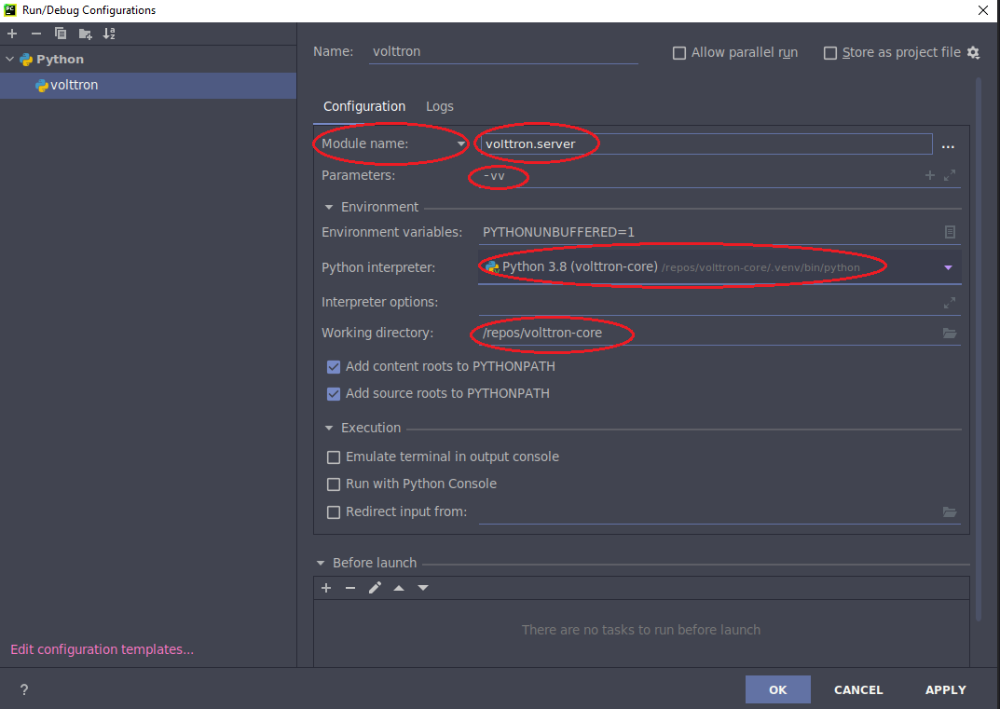
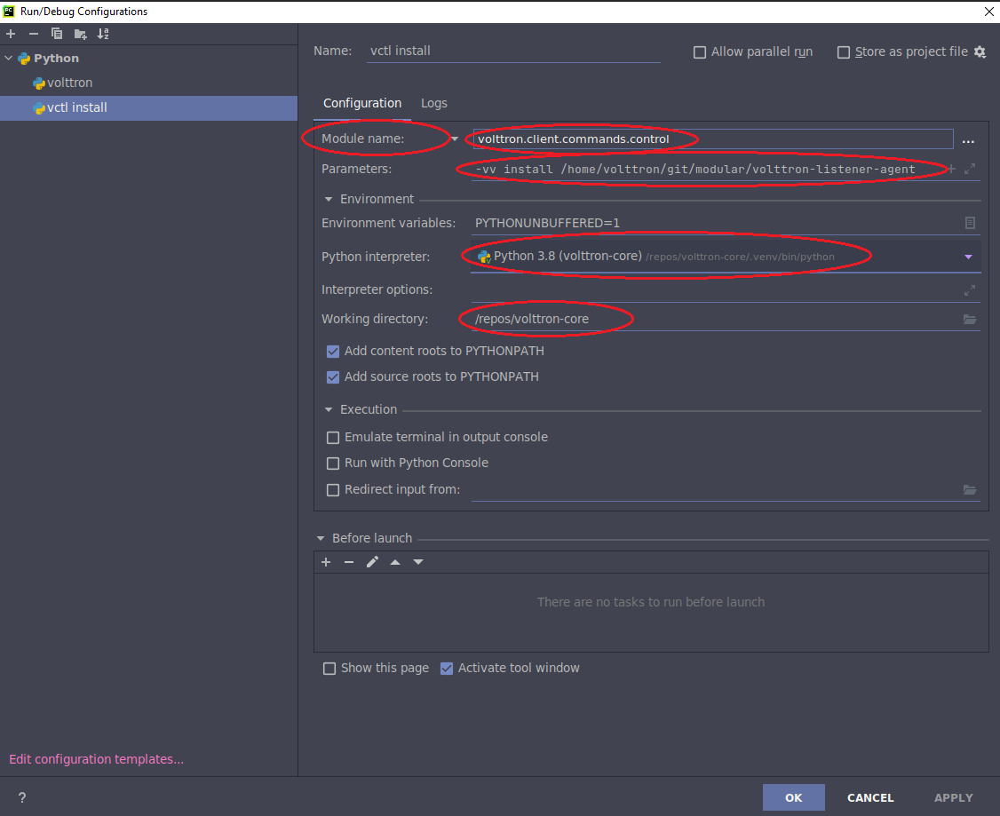

This document shows the steps involved in setting up a VOLTTRON development environment. 

## Requirements

- git >= 2.25 
- poetry >= 1.2.0b1
- python >= 3.8

Optional but handy is installing the tree command.

The below commands assume you have the required version of python already installed.

```shell
$> sudo apt install git 

# As of this writting the 1.2 version of poetry is in beta and is in the  master branch of poetry.
$> curl -sSL https://install.python-poetry.org | python3 - --preview

# Add poetry path to PATH variable. Also add this to your ~/.bashrc file  
export PATH="/home/volttron/.local/bin:$PATH"

# Configure poetry to use project root virtual environments
$> poetry config virtualenvs.in-project true

# Check the configuration
$> poetry config --list
```

## Environment Setup

For the rest of the document we assume /repos/volttron-core is the root of the git cloned repository and is designated
as the VOLTTRON_ROOT. 

**Clone the volttron-core repository**

```shell
$> cd /repos
$> git clone https://github.com/VOLTTRON/volttron-core.git --branch develop
$> cd volttron-core
```

**Installing volttron**

The following will install the volttron into a virtual environment.  The environment
can be referenced from a development environment such as visual studio code or pycharm.

```shell
$> cd /repos/volttron-core
$> poetry install
```

**Activating environment**
Now you have volttron installed in virtual environment within your volttron-core directory (/repos/volttron-core/.venv). 
You can now start VOLTTRON and run volttron commands within this virtual environment. 
There are three ways to do this
1. Prefix each python or volttron command with a "poetry run ". For example ``` poetry run vctl status```. 
2. Activate the virtual environment using activate command. ```source .venv/bin/activate```. This activates the virtual 
environment in the current shell and runs your commands using the virtual environment under /repos/volttron-core/.venv.
Once activate you can run commands such as ```vctl status``` without the "poetry run " prefix. To deactivate the 
environment run the command "deactivate". 
3. Run ```poetry shell``` to spawn a new shell within volttron-core/.venv and activates the virtual environment. 
To deactivate and exit use the ```exit``` command. This will deactivate the virtual environment and exit the shell 
spawned. **Note** Do not use ```deactivate``` command within the poetry shell, as that would deactivate the environment  
without exiting the shell spawned(python will point to system level python) and running ```poetry shell``` again will  
not work until you ```exit``` the previously spawned shell.

Now you can begin [developing an agent](AGENT_DEVELOPMENT.md), or continue on with setting up pycharm
for use with this environment.


## Pycharm Setup
- Install poetry plugin for pycharm
- 
  
- Open the volttron-core project
- Reference the python in .venv/bin/python under volttron-core directory. (Only there if you configured in-place above 
  otherwise reference virtual environment for this project)
  - In pycharm go to:
    Settings -> Python Interpreter -> Virtual Environment(on the left) -> On the right pick existing environment. 
  Give the path to python in your volttron-core's virtual environment.
  
    


## Debugging VOLTTRON in Pycharm

The following are run from the same python environment and are highlighted red where
either changes need to be made from the default or are areas that should be verified
are correct for the different use cases.

Make sure that your pycharm settings are gevent compatible


Create a Run/Debug configuration for volttron and vctl like the following. Make sure you are pointing to the python 
interpreter that is under volttron-core's virtual environment and the working directory points to cloned volttron-core 
directory





## Commiting code changes ##

1. Changes should be done to new branch on your own fork, and PR should be created to merge to main branch.
   

Please see [Agent Development](AGENT_DEVELOPMENT.md) for more information on developing agents for volttron.
