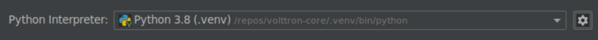
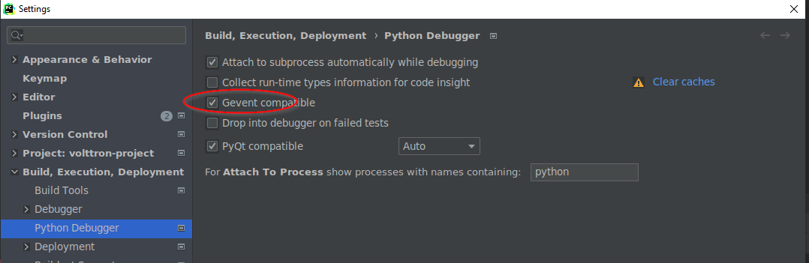

This document show how to set up your development environment if you want to edit VOLTTRON core - which consists of 
1. volttron-server
2. volttron-client
3. volttron-utils

## Requirements

The setup script uses pipenv.  We need to use the default dependencies of volttron plus
pipenv.  

```bash 
$> sudo apt install pipenv
```

## setup-environment.sh

This script will clone the core repositories.  Please read and edit the script before
executing the following command.  Directions for variables are set inline within
the script for documentation.

```bash
$> bash setup-environment.sh
```

After running the script you will have the core repositories cloned with the specified
branches in your REPO_ROOT.  Assuming REPO_ROOT is /repo the following should be your
tree.

```bash
$> tree -L 1
.
├── volttron-client
├── volttron-server
└── volttron-utils
```

Each repository has its own virtual environment synced with pipenv.  The next task
is to have the volttron-server environment as the main environment and have the other
volttron-utils and volttron-client be able to be edited.

##  Adding environment links

Usually when installing packages using pipenv you would execute ```pipenv install package```.
However, we want everything to be editable in our projects so that it makes development
easier.  

1. Open a command line to the volttron-server repository
2. execute ```pipenv install -e ../volttron-client --dev```
3. execute ```pipenv install -e ../volttron-utils --dev```
4. execute ```pipenv install -e . --dev```
5. To get an activated shell run ```pipenv shell```  alternatively you can prefix any command with ```pipenv run ```
   in order run in the pipenv virtual environment. 
6. At this point you can start volttron using  ```volttron -vv``` from an activated shell or 
   run ```pipenv run volttron -vv``` if you did not activate env using ```pipenv shell```

### Other handy commands

- ```pipenv --rm``` removes your virtual environment
- ```pipenv --venv``` shows you the path to the virtual environment
- ```pipenv shell``` activates the current projects virtual environment.
- ```pipenv graph``` shows a dependency graph of all dependencies for the environment
- ```pipenv install <package>``` installs a package into environment.
- ```pipenv install <package> --dev``` installs a development dependency.
- ```pipenv uninstall <package>``` uninstalls a package
- ```pipenv run <command>``` executes command in the python environment of the directory.
- ```pipenv lock -r > requirements.txt``` generates a requirements.txt from the Pipfile.lock
- ```pipenv sync``` syncs changes from Pipfile to lock file
- ```pipenv-setup sync``` syncs changes to the setup.py file for the repository.

## Pycharm Setup

Open volttron-server project. Set the python interpreter to the python under volttron-server's virtual environment. 
The path to the virtual environment can be got by running the command ```pipenv --venv``` from within volttron-server 
source directory. In pycharm go to:
Settings -> Python Interpreter -> Virtual Environment(on the left) -> On the right pick existing environment. 
Give the path to python in your volttron-server's virtual environment. Check the box that says 
"make this available to all projects"




Open volttron-client project, and volttron-utils project. For both pick the option attach when you get a popup. Pick 
python interpreter for both volttron-client and volttron-utils as volttron-server's python interpreter.
i.e. All projects should be referencing the same python environment (volttron-server) from the virtualenv settings
within the projects.

In pycharm Settings-> Project: volttron-serer -> Project Dependencies. Make volttron-server depend on volttron-client and
utils. Make volttron-client depend on volttron-utils


Once you update and save these settings your Project tree on the left should show a project called 'volttron-server' 
and under that list the source folders of volttron-server, volttron-client, and volttron-utils. These three folders should
automatically show up as source root (folder icon should be blue). If it does not show up as source root, manually right
click on the source folder and pick 'Mark directory as' -> 'Sources root'


Optional steps:

1. If you do not wish to have a "volttron-server" project and a "volttron-server" source folder under the project, you 
   can rename the project by highlighting the top of the tree (the project volttron-server) and choosing 'rename project' 
   option from the "File" menu.


2Clicking the "Projects" menu allows you to see the project files instead of the project view.


## Debugging VOLTTRON in Pycharm

The following are run from the same python environment and are highlighted red where
either changes need to be made from the default or are areas that should be verified
are correct for the different use cases.

Make sure that your pycharm settings are gevent compatible



Create a Run/Debug configuration for volttron and vctl like the following. 

---
**NOTE**
The below two screenshots show the project as "volttron-project". If you skipped the optional steps replace 
"volttron-project" with "volttron-server" 
---


## Commiting code changes ##

1. Changes should be done to new branch and PR should be created to merge to main branch
2. **IMPORTANT NOTE** - Before pushing changes to volttron-server repository, revert reference to local directories
   (volttron-serer, volttron-client, and volttron-utils) from the Pipfile. The relevant lines would look similar to

   ```
   [dev-packages.6f484ac]
   path = "./../volttron-client"
   editable = true
   
   [dev-packages.77c214e]
   path = "./../volttron-utils"
   editable = true
   
   [dev-packages.e1839a8]
   path = "."
   editable = true
   ```
   
   The above lines get added when we run ```pipenv install -e [.|../volttron-client|../volttron-utils]``` and is only 
   relevant for local development. It should not get checked into volttron-server repository. 