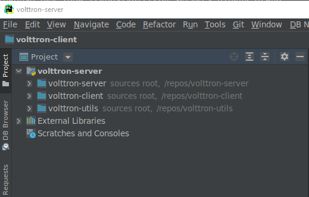
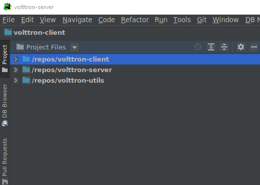

# volttron-developer

This repository has miscellaneous scripts for helping to maintain VOLTTRON
related repositories.

## setup-environment.sh

This script will clone the core repositories.  Please read and edit the script before
executing the following command.  Directions for variables are set inline within
the script for documentation.

```bash
$> bash setup-environment.sh
```

After running the script you will have the core repositories cloned with the specified
branches in your REPO_ROOT.  Assuming REPO_ROOT is /repo the following should be your
tree.

```bash
$> tree -L 1
.
├── volttron-client
├── volttron-server
└── volttron-utils
```

Each repository has its own virtual environment synced with pipenv.  The next task
is to have the volttron-server environment as the main environment and have the other
volttron-utils and volttron-client be able to be edited.

##  Adding environment links

Usually when installing packages using pipenv you would exicute ```pipenv install package```.
However for us we want everything to be editable in our projects so that it makes development
easier.  

1. Open a command line to the volttron-server repository
2. execute ```pipenv install -e ../volttron-client```
3. execute ```pipenv install -e ../volttron-utils```
4. execute ```pipenv install -e .```

Executing ```pipenv run volttron -vv``` should start the volttron server at this point in time.

### Other handy commands

- ```pipenv shell``` activates the current projects virtual environment.
- ```pipenv graph``` shows a dependency graph of all dependencies for the environment
- ```pipenv install <package> --dev``` installs a development dependency.
- ```pipenv uninstall <package>``` uninstalls a package
- ```pipenv run <command>``` executes command in the python environment of the directory.
- ```pipenv lock -r > requirements.txt``` generates a requirements.txt from the Pipfile.lock
- ```pipenv sync``` syncs changes from Pipfile to lock file
- ```pipenv-setup sync``` syncs changes to the setup.py file for the repository.

## Pycharm Setup

Opening and attaching volttron-server, volttron-client and volttron-utils in pycharm should look like the following 
image:



One can rename the project by highlighting the top of the tree volttron-server and choosing 'rename project' 
option from the file menu.

Clicking the "Projects" menu allows you to see the project files instead of the project view.



All projects should be referencing the same python environment (volttron-server) from the virtualenv settings
within the projects.


